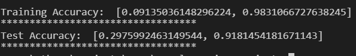

# Aural Mapping

## Wireless Sensor Network based Real-time Noise Detection and Noise Monitoring on Urban areas and cities. 

## Abstract

Monitoring environmental parameters is an area of research that has attracted scientific attention 
during the last decades. The concept of smart cities often needs information including variables 
like CO2 levels, Water quality, Air quality or Noise levels. Monitoring these environmental 
parameters in large areas over a longer period of time is an expensive and complex process. But 
with the evolving of low-cost and low-power devices which is capable of doing complex tasks, 
has opened a wide area for researchers to develop monitoring devices to deploying a Wireless 
Sensor Network(WSN). The information gathered from these monitoring devices can be used in 
urban city controlling and planning and also it could help citizens. In this work, we described the 
prototyping of low-cost and low-power Raspberry pi sensor node based WSN, how we can 
analyze noise levels in urban areas and cities in real-time. Node devices are connected with 
google cloud to share and process this information in real-time. Processed data can be obtained in 
real-time by relevant administrations (Eg: Central Environmental Authority) and can analyse the 
data. , Also a mobile app is developed for the public users to visualize areas where noise 
pollution is high and be aware of them. 

## Objectives
Our goals are to,
  * Help users to avoid the effects of noise pollution and to make them aware of the dangerous effects caused by noise pollution in their daily life.
  * This can be used as a tool by the public administrations to monitor the public whether they adhere to noise levels which include noises from people, vehicles, and noise generated by factories.
  * Help the administration to easily handle complaints from the public if any unusual sounds occur in their neighborhood. Eg: gunshots, musical events, dog barking. 

## Deliverables
  * Raspberrypi sensor node based  wireless sensor network which can,
    * Measure noise levels ( in decibel ) in urban areas
    * Detect the type of noise.
      * Eg: Engine noise, Musical show, Dog barking,  Gunshot, etc. 
    * Share the information with the cloud in real-time.
  * A mobile app for public users.
  * A web-app for the public administrations to visualize the data.

## Sound Detection/Classification
To handle complaints from public regarding noise levels within their neighborhood, relevent authorities would need information about the type of the noise. In our work, noise sensor node will record the surrounding noise when the noise level exceed a certain threshold value [ as a 4sec .wav audio file]. From that, our sound classification model will predict the class of the given audio file. 

## Implementation of Sound Classification Model
We used a convolutional neural network(CNN) instead of recurrent neural network(RNN) to build our model. The reason behind using CNN instead of RNN is, our input data doesn't depend on past or future memory. We used UrbanSound8K dataset which contains 10 different classes of sounds ( air_conditioner, car_horn, children_playing, dog_bark, drilling, engine_idling, gun_shot, jackhammer, siren, street_music ) as our input dataset. We converted each audio file into an image file using mfcc feature representation. We trained our model on GTX 1050Ti GPU and obtained 98.31% training accuracy and 91.81% test accuracy.

  * Network Architecture 

  * Train-Val Accuracy vs Epoch graph of our model

  * Train-Val Loss vs Epoch graph of our model

## Implementation of Mobile App (For public users)
To help users to avoid being exposed to a noisy area, we have developed a mobile app which will fetch information from our wireless sensor network in real-time and alert the user if the noise level exceeds the threshold limit. Also user can visualize noise levels in their surrounding area and get an absract picture of how noise level varies in their surroundings.
Our mobile app can track the user's location even when the app is closed. For each node, based on noise level (in dB) we have defined two safety-level zones as Warning zone and Danger zone. When there is a danger zone and the user enters to the warning zone, user will get an alert message as illustrated below,

There is a backround service in our app which will run always even after killing it or restart the phone.
